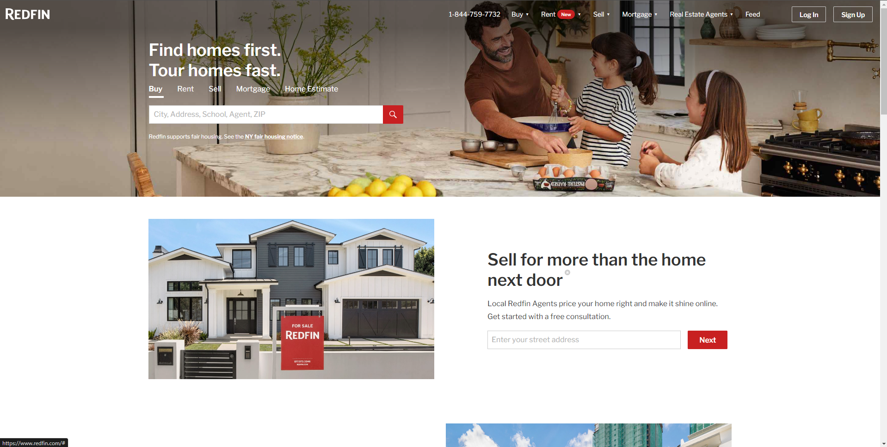
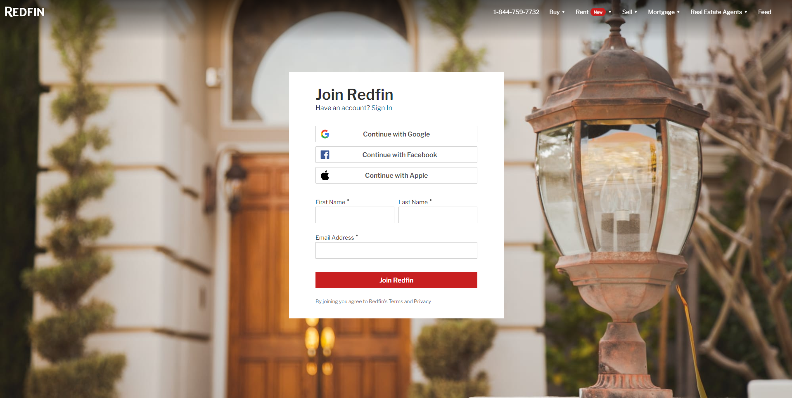
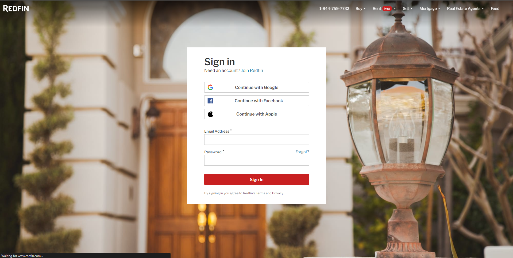
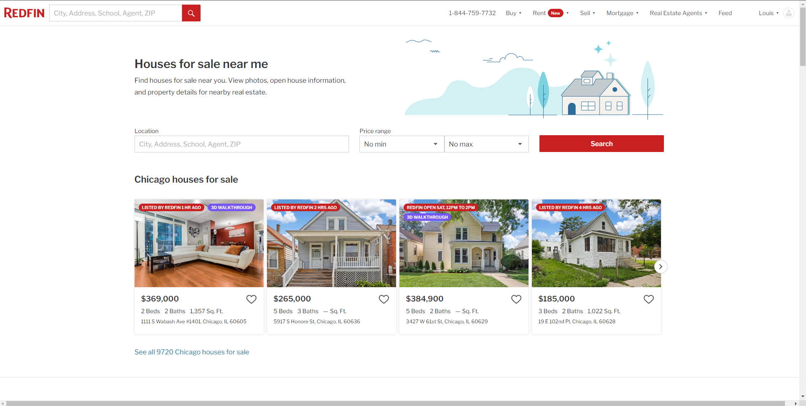
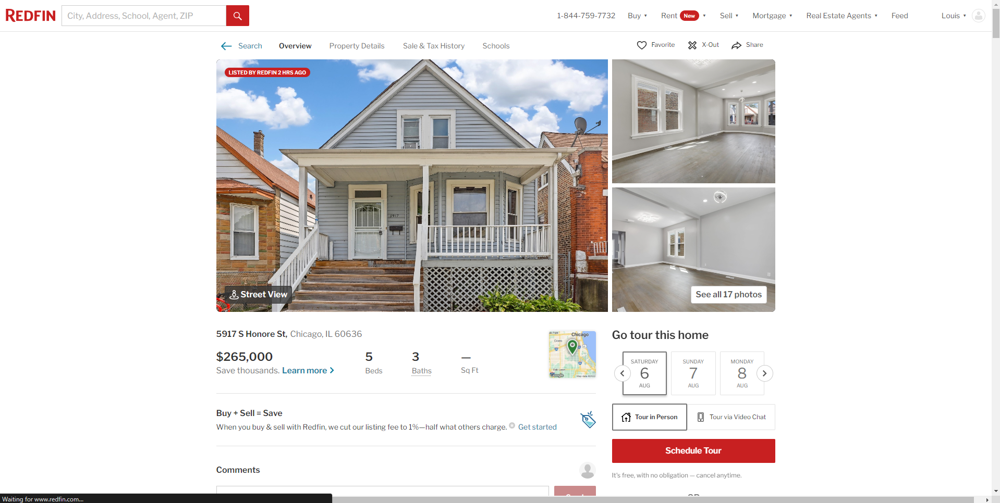
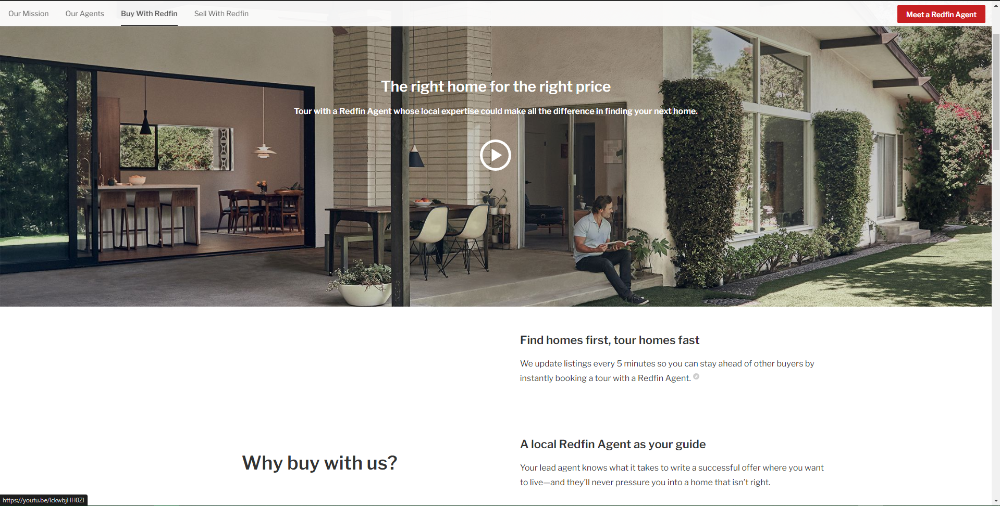

# Redfin

Makazi is a Real Estate web application that allows Agents to manage properties. It also allows Users to access, and browse through properties as they make decisions about which to buy. Watch a live demo on [Youtube Video](https://youtu.be/LUx2aZwh64I).

### By Tiberius Mairura, 31/07/2022

## Landing Page

## Signup Page

## Login Page

## Listings Page

## Listings Details Page

## Listings Update Page

## 

## Features

As an Agent you should be able to:

1. `Register`  an agent account
2. `Upload` new listing
3. `Update` listings
4. `Delete` listings

As User you should be able to:

1. `Register`  a user account
2. `View`  listings
3. `View` agent profiles and contact information

[Go Back to the top](#Makazi)

### Requirements

- Access to  a computer, mobile phone or any other garget
- Internet access

### Installation Process

****

- Clone to this repo by running the command : `git clone https://github.com/hermitex/makazi.git`
- Unzip the downloaded files in a folder of choice.
- Open the folder with your favorite CLI tool.
- Run `npm install` on your terminal from inside the root folder of the project
- Run `node server.js` on your terminal from inside the root folder of the project to run the server
- The server should run on `http://localhost:3000` by default
- If the port is busy, kindly feel free to change the port inside the server.js file
- Once the server is up and running, visit the link  `http://localhost:3000` to access the application
- You can also check out the app's API at [Makazi API](https://github.com/hermitex/makazipopote-api)
  
 ****
[Go Back to the top](#Redfin)

- HTML -to develop the structure off the page

- CSS - to style the User Interface
- Java (Spring Boot) - To build a RESTful API
- ReactJS - Building component based UI
